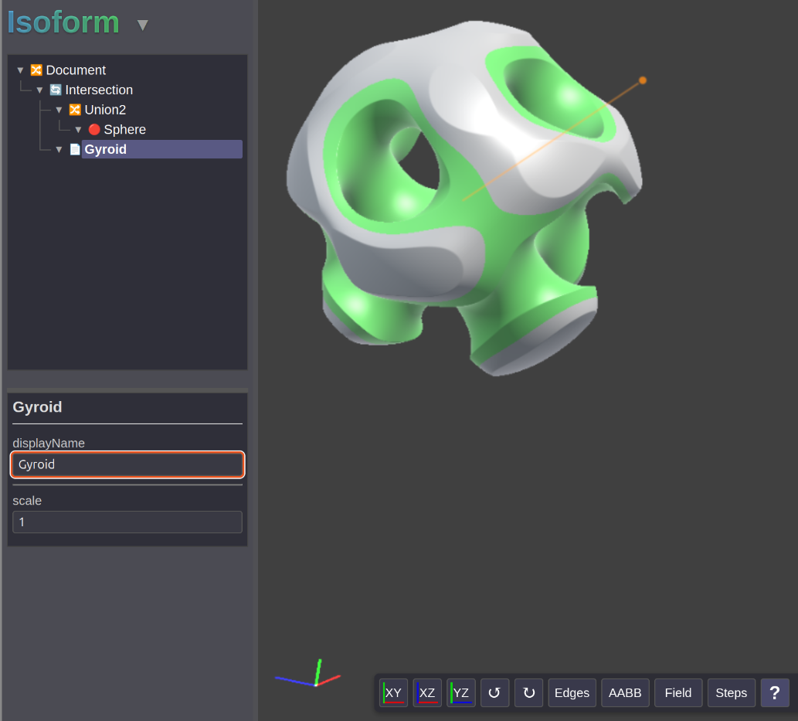

# Isoform

Isoform is a CAD system based on [Signed Distance Functions](https://en.wikipedia.org/wiki/Signed_distance_function).

**Work in progress**. Current status is it is not anywhere near ready to use.

Isoform runs in the browser using WebGL.

You can run it locally:

    $ git clone https://github.com/jes/isoform
    $ xdg-open isoform/index.html

Or try out a hosted version: https://incoherency.co.uk/isoform/

